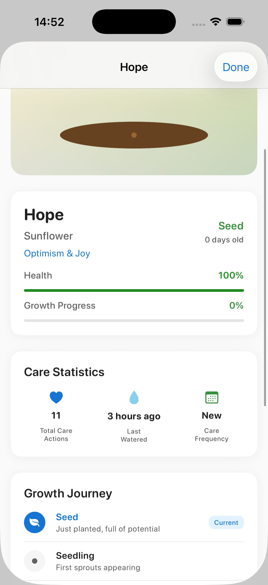
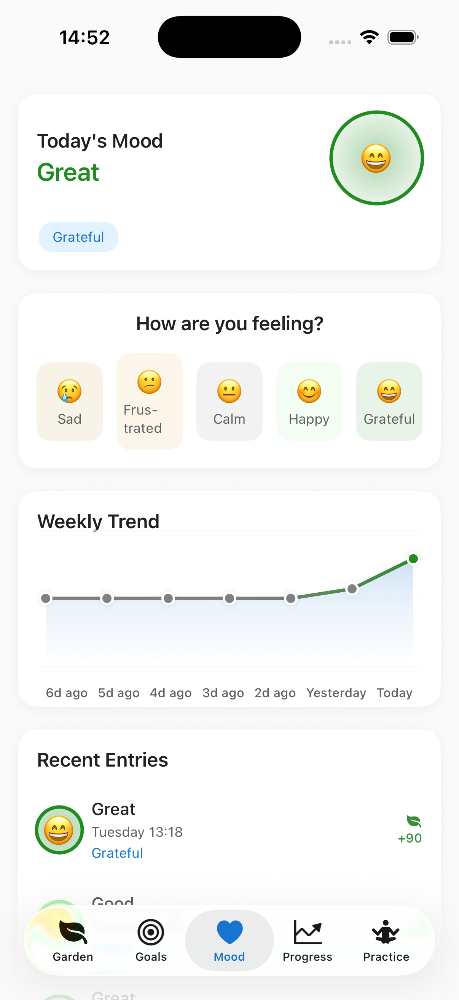
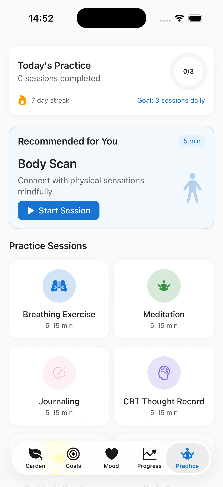

# 🌱 MindGarden – Showcase

**MindGarden** ist eine sanfte, motivierende Begleiter-App für mentale Gesundheit.  
Diese öffentliche Präsentation gibt einen Einblick in das Design, die Idee und die Vision der App – **ohne Quellcode**.

---

## ✨ Vision

MindGarden ist aus einer sehr persönlichen Reise entstanden – mit dem Wunsch, mentale Gesundheit alltagstauglich, sanft und motivierend zu begleiten.  
Die Idee: Selbstfürsorge soll sich nicht wie eine Pflicht anfühlen, sondern wie ein liebevolles Ritual – so natürlich wie das Pflegen eines Gartens.

---

## 🧠 Features (geplant & umgesetzt)

- ✅ CBT-basierte Denkmuster-Übungen  
- ✅ Wachsende Pflanze als Motivator  
- ✅ Mood-Tracking  
- ⏳ Atemübungen & Achtsamkeitsimpulse  
- ⏳ Widgets & individuelle Erinnerungen  
- ⏳ Personalisierte Routinen

---

## 🎨 Designvorschau

  
  
  

---

## 🚧 Aktueller Stand

> Version: `v0.1.2-alpha`  
> MindGarden befindet sich derzeit in aktiver Entwicklung. Der Code ist bewusst **nicht öffentlich** – Fokus liegt aktuell auf Vision, Design und Tests.

---

## 🔒 Hinweis

Dies ist ein **Showcase-Repository**. Der Quellcode der App ist privat und nicht Teil dieses Repos.

---

## 📬 Feedback willkommen

Fragen, Ideen oder Feedback?  
→ Einfach ein [Issue öffnen](https://github.com/Matshio7/mindgarden-showcase/issues)
